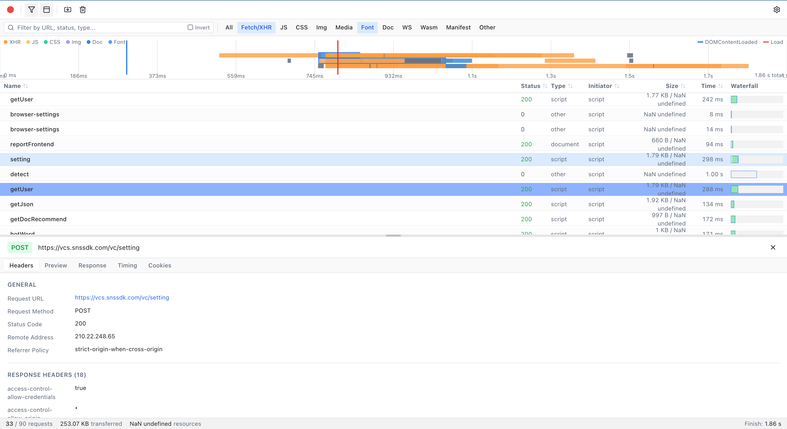

# Network Panel

A Chrome DevTools Network Panel UI Clone - A modern web application for analyzing network requests from HAR files.




## Features

### Core Features
- **HAR File Import**: Import and analyze HAR (HTTP Archive) files
- **Drag & Drop**: Simply drag HAR files onto the window to import
- **Mock Data**: Automatically loads sample data for demonstration
- **Virtual Scrolling**: Handles 10,000+ requests with smooth 60fps rendering using @tanstack/react-virtual

### Request Table
- **Columns**: Name, Status, Type, Initiator, Size, Time, Waterfall
- **Sorting**: Click column headers to sort (ascending/descending)
- **Row Selection**: Click any row to view detailed information
- **Context Menu**: Right-click for copy URL, copy as cURL, open in new tab
- **Visual Waterfall**: Color-coded timing bars showing request phases

### Filtering
- **Text Filter**: Search by URL, status code, or content type
- **Type Filters**: Filter by resource type (XHR, JS, CSS, Img, Media, Font, Doc, WS, Wasm, Manifest, Other)
- **Invert Filter**: Negate the current filter
- **Real-time Filtering**: Debounced input for smooth performance

### Detail Pane
- **Headers Tab**: View request/response headers, query params, form data
- **Preview Tab**: JSON tree viewer, image preview, HTML preview
- **Response Tab**: Raw response body with syntax highlighting (JSON, HTML, CSS, JS)
- **Timing Tab**: Visual waterfall breakdown of request phases
- **Cookies Tab**: Request and response cookies table

### UI/UX
- **Dark/Light Mode**: Full theme support with system preference detection
- **Keyboard Shortcuts**: Efficient navigation with keyboard
- **Resizable Panels**: Drag to resize the detail pane
- **Status Bar**: Summary of requests, transferred data, and load time

## Keyboard Shortcuts

| Shortcut | Action |
|----------|--------|
| `Ctrl/Cmd + F` | Focus filter input |
| `Ctrl/Cmd + R` | Toggle recording |
| `Ctrl/Cmd + O` | Import HAR file |
| `↑ / ↓` | Navigate between requests (when detail pane is open) |
| `Esc` | Close detail pane |

## Installation

### Prerequisites
- Node.js 18+
- npm or yarn

### Setup

```bash
# Install dependencies
npm install

# Start development server
npm run dev

# Build for production
npm run build

# Preview production build
npm run preview
```

## Usage

### Importing HAR Files

1. **Drag & Drop**: Simply drag a `.har` file onto the window
2. **Import Button**: Click the Import button in the toolbar (or Ctrl/Cmd+O)
3. **Sample Data**: The app automatically loads sample data on first launch

### Creating HAR Files

HAR files can be exported from:
- **Chrome DevTools**: Network tab → Export HAR
- **Firefox DevTools**: Network tab → Save All As HAR
- **Safari**: Develop menu → Export HAR
- **Edge**: Network tab → Export HAR

## Technology Stack

- **Framework**: React 19
- **Language**: TypeScript 5.3+
- **Styling**: Tailwind CSS 3.4
- **State Management**: Zustand with persistence
- **Virtualization**: @tanstack/react-virtual
- **Icons**: Lucide React
- **Build Tool**: Vite 7

## Project Structure

```
src/
├── components/
│   ├── network-panel/      # Main panel components
│   │   ├── NetworkPanel.tsx
│   │   ├── ActionBar.tsx
│   │   ├── FilterToolbar.tsx
│   │   ├── StatusBar.tsx
│   │   └── EmptyState.tsx
│   ├── requests-table/     # Request list components
│   │   ├── RequestsTable.tsx
│   │   ├── RequestRow.tsx
│   │   └── TableHeader.tsx
│   ├── detail-pane/        # Detail view components
│   │   ├── DetailPane.tsx
│   │   ├── HeadersTab.tsx
│   │   ├── PreviewTab.tsx
│   │   ├── ResponseTab.tsx
│   │   ├── TimingTab.tsx
│   │   └── CookiesTab.tsx
│   └── ui/                 # Reusable UI components
│       ├── button.tsx
│       ├── input.tsx
│       ├── checkbox.tsx
│       ├── tabs.tsx
│       ├── tooltip.tsx
│       └── dropdown-menu.tsx
├── hooks/                  # Custom React hooks
│   ├── useHARImport.ts
│   ├── useKeyboardShortcuts.ts
│   └── useTheme.ts
├── stores/                 # State management
│   └── networkStore.ts
├── types/                  # TypeScript types
│   └── har.ts
├── lib/                    # Utilities
│   └── utils.ts
├── App.tsx                 # Main app component
├── main.tsx                # Entry point
└── index.css               # Global styles
```

## Performance

- **Virtual Scrolling**: Only visible rows are rendered
- **Memoization**: Components optimized to prevent unnecessary re-renders
- **Efficient Filtering**: Debounced filter input for smooth typing
- **Large Dataset Support**: Tested with thousands of network requests

## Browser Support

- Chrome/Edge 90+
- Firefox 88+
- Safari 14+
- Opera 76+

## Known Limitations

1. **No Real-time Capture**: This is a UI-only implementation. It cannot capture live network traffic from your browser.
2. **HAR 1.2 Format**: Optimized for HAR 1.2 specification.
3. **No Request Blocking**: UI for blocking requests exists but doesn't actually block requests.
4. **No Throttling Simulation**: Throttling dropdown is UI-only.

---

## 📝 Dialog History - How This Project Was Built

This project was created through a conversational AI-assisted development process. Below is the complete history of prompts used:

### Prompt 1: Project Initialization
> "summon multiple experts on chrome, react front end and ui recreation, detail experts, project maangers, to reacreate the chrome network tab ui as much as possible with mock data. @PRD-Network-Panel-UI.md"

**Result**: 5 expert subagents were summoned in parallel:
- React/TypeScript Architect - Project foundation
- Chrome DevTools UI Specialist - UI components  
- Data Table & Virtualization Expert - Virtualized table
- Mock Data Specialist - HAR mock data
- Project Manager - Integration

**Delivered**: Complete Chrome DevTools Network Panel clone with 175+ mock requests

---

### Prompt 2: Fix Border Styling
> "I guess tailwind configuration has issues ? acuse borders are so bold, and obvious, can you check it ?"

**Result**: 
- Changed border colors from `#d4d4d4` to subtler `#e5e5e5` (light) and `#3b3b3b` to `#333333` (dark)
- Added Chrome DevTools specific color variables
- Added `.border-subtle`, `.border-hairline` utility classes

---

### Prompt 3: Add Overview Timeline
> "I think overall is pretty good, but we are missing something arent we ? 概况模块?"

**Result**: 
- Created `OverviewTimeline.tsx` component
- Added Canvas-based timeline visualization with color-coded resource bars
- Added DOMContentLoaded (blue) and Load (red) marker lines
- Added legend, hover tooltips, and click-to-select functionality
- Added toggle button in ActionBar
- Updated store with `showOverview` state

---

### Prompt 4: Start Development Server
> "npm run dev"

**Result**: Vite dev server started at `http://localhost:3000/`

---

### Prompt 5: Push to GitHub
> "push it here, git@github.com:borankux/chrome-network-panel-recreation-vibe.git"

**Result**: 
- Initialized Git repository
- Committed 48 files (10,096 lines)
- Pushed to GitHub

---

### Prompt 6: Add Screenshot
> "tehre is a devnetwork.png on desktop, put that in project and add to the readme top"

**Result**: 
- Copied `devnetwork.png` from Desktop to `public/`
- Added screenshot to README top
- Committed and pushed

---

### Prompt 7: Summarize Prompts
> "can you summorize all the prompts that I used for this project ?"

**Result**: Generated summary of all prompts used

---

### Prompt 8: Add Dialog History to README
> "put my prompts in the read me as dialog history. in the readme"

**Result**: Added this section documenting the entire development conversation

---

## 📊 Project Stats

| Metric | Value |
|--------|-------|
| Prompts Used | 8 |
| Code Generated | ~10,000+ lines |
| Components Built | 20+ |
| Mock Requests | 175+ |
| Time to Complete | ~1 hour |

## License

MIT License
